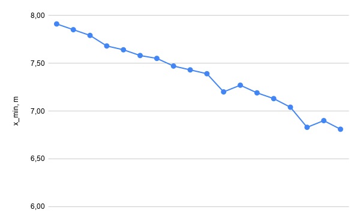
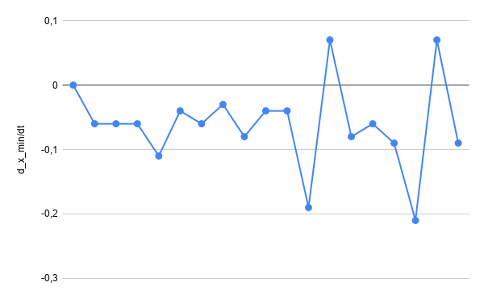
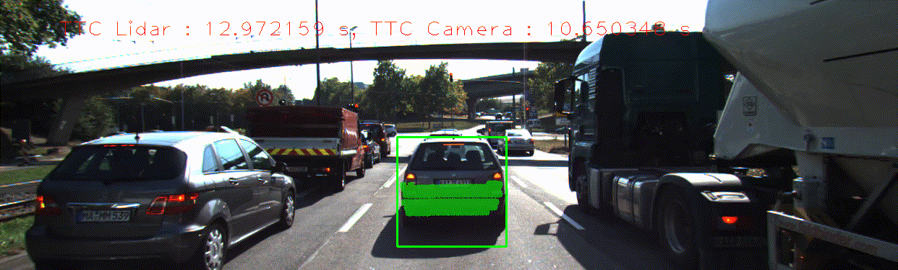

# SFND 3D Object Tracking

Welcome to the final project of the camera course. By completing all the lessons, you now have a solid understanding of keypoint detectors, descriptors, and methods to match them between successive images. Also, you know how to detect objects in an image using the YOLO deep-learning framework. And finally, you know how to associate regions in a camera image with Lidar points in 3D space. Let's take a look at our program schematic to see what we already have accomplished and what's still missing.


In this final project, you will implement the missing parts in the schematic. To do this, you will complete four major tasks: 
1. First, you will develop a way to match 3D objects over time by using keypoint correspondences. 
2. Second, you will compute the TTC based on Lidar measurements. 
3. You will then proceed to do the same using the camera, which requires to first associate keypoint matches to regions of interest and then to compute the TTC based on those matches. 
4. And lastly, you will conduct various tests with the framework. Your goal is to identify the most suitable detector/descriptor combination for TTC estimation and also to search for problems that can lead to faulty measurements by the camera or Lidar sensor. In the last course of this Nanodegree, you will learn about the Kalman filter, which is a great way to combine the two independent TTC measurements into an improved version which is much more reliable than a single sensor alone can be. But before we think about such things, let us focus on your final project in the camera course. 

## Dependencies for Running Locally
* cmake >= 2.8
  * All OSes: [click here for installation instructions](https://cmake.org/install/)
* make >= 4.1 (Linux, Mac), 3.81 (Windows)
  * Linux: make is installed by default on most Linux distros
  * Mac: [install Xcode command line tools to get make](https://developer.apple.com/xcode/features/)
  * Windows: [Click here for installation instructions](http://gnuwin32.sourceforge.net/packages/make.htm)
* OpenCV >= 4.1
  * This must be compiled from source using the `-D OPENCV_ENABLE_NONFREE=ON` cmake flag for testing the SIFT and SURF detectors.
  * The OpenCV 4.1.0 source code can be found [here](https://github.com/opencv/opencv/tree/4.1.0)
* gcc/g++ >= 5.4
  * Linux: gcc / g++ is installed by default on most Linux distros
  * Mac: same deal as make - [install Xcode command line tools](https://developer.apple.com/xcode/features/)
  * Windows: recommend using [MinGW](http://www.mingw.org/)

### Building OpenCV on Linux  

If you already got some other opencv version, you first can uninstall it (e.g. via `make`):  
```
cd ~/opencv/build
sudo make uninstall
cd .. && sudo rm -r build
cd && sudo rm -r /usr/include/opencv2 /usr/include/opencv /usr/include/opencv /usr/include/opencv2 \
                 /usr/share/opencv /usr/share/OpenCV /usr/share/opencv /usr/share/OpenCV /usr/bin/opencv* \
                 /usr/lib/libopencv* /usr/local/include/opencv2 /usr/local/include/opencv \
                 /usr/local/include/opencv /usr/local/include/opencv2 /usr/local/share/opencv \
                 /usr/local/share/OpenCV /usr/local/share/opencv /usr/local/share/OpenCV \
                 /usr/local/bin/opencv* /usr/local/lib/libopencv* 
```  

And then build an actual version along with the opencv-contrib:  
```
git clone --depth 10 --branch 4.1.0 https://github.com/opencv/opencv ~/opencv
git clone --depth 10 --branch 4.1.0 https://github.com/opencv/opencv_contrib ~/opencv_contrib
mkdir -p ~/opencv/build && cd ~/opencv/build
sudo cmake -D CMAKE_BUILD_TYPE=RELEASE \
           -D CMAKE_INSTALL_PREFIX=/usr/local/ \
           -D OPENCV_EXTRA_MODULES_PATH=~/opencv_contrib/modules \
           -D OPENCV_ENABLE_NONFREE=ON \
           -D WITH_IPP=OFF \
           -D WITH_CUDA=OFF \
           -D WITH_OPENCL=ON \
           -D BUILD_TESTS=ON \
           -D BUILD_PERF_TESTS=OFF \
           -D INSTALL_PYTHON_EXAMPLES=ON \
           -D OPENCV_GENERATE_PKGCONFIG=ON \
           ..
sudo make -j"$(nproc)" install
sudo ldconfig
rm -rf ~/.cache/*  
```  

## Basic Build Instructions  

1. Clone this repo.
2. Make a build directory in the top level project directory: `mkdir build && cd build`
3. Compile: `cmake .. && make`
4. Run it: `./3D_object_tracking <DETECTOR_TYPE> <DESCRIPTOR_TYPE>`.   
   Where detector types are: HARRIS, FAST, BRISK, ORB, AKAZE, SIFT.   
   Descriptor types: BRISK, BRIEF, ORB, FREAK, AKAZE, SIFT.  

## Report  

[Link to the "raw" spreadsheet](https://docs.google.com/spreadsheets/d/1kIJuspA_IKuvyX_ubBmtlJx4LZ6J1_Uemq9vPAbIhl8/edit?usp=sharing).  

### Lidar TTC  

If we look at the computed TTC, it can be immediately noticed 2 outliers with TTC < 0 and one with pretty large TTC ~34 seconds.  

<p align="center">  </p>  

But when we look at the distance to the precending vehicle (from the lidar measurements) and, especially, at it's time derivative (or difference approximation, to be precise) - it looks like the precending vehicle moves forward... But, I'd better say that it is some noise in distance measurements.  

<p align="center">    </p>  

The same is with the large TTC values - it occured when the measured distance derivative goes up, but doesn't reach zero - in other words the distance slightly increases at a moment.  

### Camera TTC  

I've compared all possible combinations of the given detectors and feature extractors, so here is a short summary:  

 - **Harris detector** always makes result bad - a lot of nans in TTC.  
 - **SIFT keypoints + FREAK descriptors**: ~80% of TTC < 0 - wich is also bad, since we can't distinguish increasing and decreasing distance;  
 - **FAST keypoints + BRISK descriptors**: another problem - huge TTC dispersion;  

   Actually, the reason of above results is that median distance ratio sometime becomes slightly less or == 1, which is mostly can be caused by "weak" keypoints detection algorithm.  

 - robust examples of detection & feature extraction algorithms which gives **repeatable and stable TTC**, are:  
     - **FAST keypoints + ORB descriptors** (also fastest pair as well);  
     - **AKAZE keypoints + ORB descriptors**;  
     - **AKAZE keypoints + SIFT descriptors**;  
   Examples of estimated TTC showed below:  
   <p align="center">   </p>  

***Here is an example of TTC estimation using both lidar and camera (FAST+ORB processing)***  
<p align="center">   </p>  